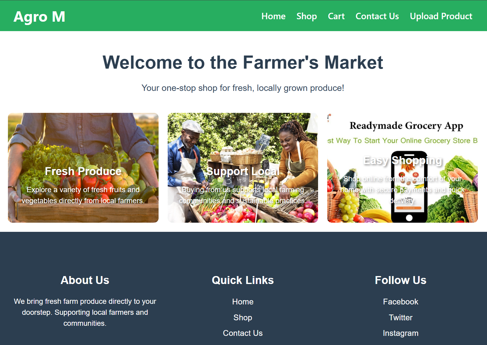
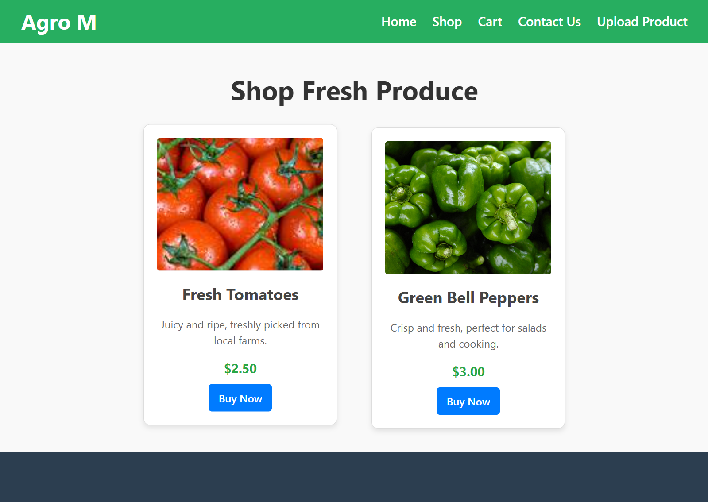
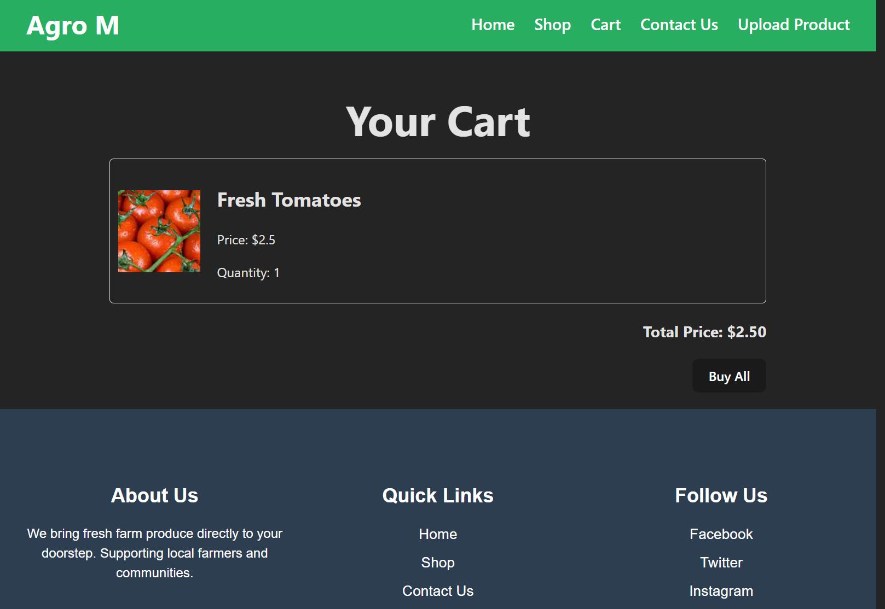
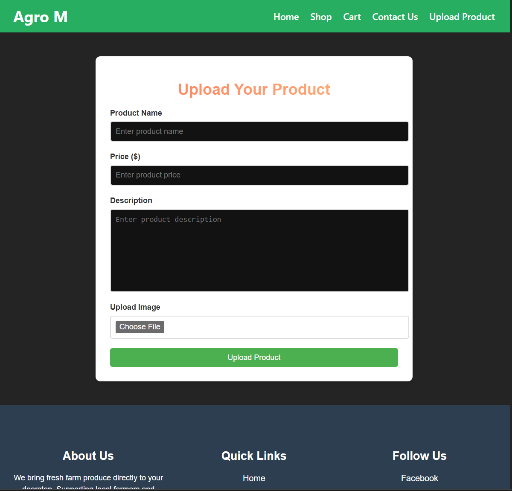
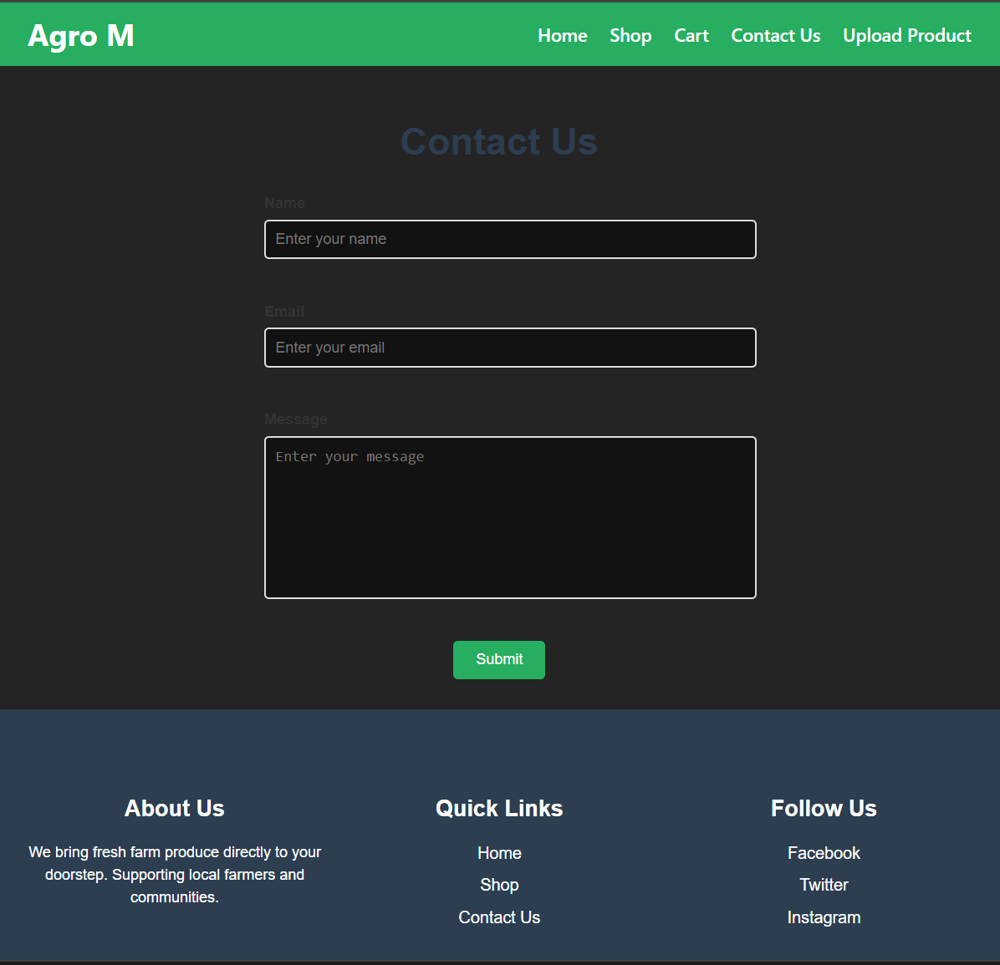

# Agro-M - Local Produce Shopping Website

## Overview
Farmer's Market is a web-based platform where local farmers can upload their produce for sale, and consumers can browse and purchase fresh, locally-grown items. This project aims to connect farmers directly with customers, promoting sustainable and local agriculture.

---

## Features
- **Home Page**: Welcomes users with an overview of the platform's purpose.
- **Shop Page**: Displays a variety of fresh products with details and purchase options.
- **Cart**: Shows selected items with pricing and a "Buy All" feature.
- **Upload Product**: Allows farmers to upload details and images of their products.
- **Contact Us**: Provides a form for customer inquiries.
- **Payment Page**: Simulates a basic payment process.

---

## Technologies Used
- **Frontend**: React, Vite, CSS
- **Backend**: Node.js, Express.js
- **Database**: MongoDB
- **Routing**: React Router
- **Styling**: Custom CSS
- **Version Control**: Git & GitHub

---

## Screenshots
#### **1. Home Page**


#### **2. Shop Page**


#### **3. Cart Page**


#### **4. Upload product Page**


#### **5. Contact Us Page**



---

## Setup Instructions
1. **Clone the Repository**:
   ```bash
   git clone https://github.com/Manvithshetty13/Agro_M.git
   ```
2. **Install Dependencies**:
   ```bash
   cd farmers-market
   npm install
   ```
3. **Start the Frontend**:
   ```bash
   npm run dev
   ```
4. **Start the Backend**:
   Navigate to the `Backend` folder and run:
   ```bash
   node server.js
   ```
5. **Environment Variables**:
   Create a `.env` file in the `Backend` folder with the following:
   ```env
   MONGO_URI=<Your MongoDB URI>
   PORT=5000
   ```

---

## Folder Structure
```
farmers-market/
├── src/
│   ├── components/
│   │   ├── Header/
│   │   ├── Footer/
│   │   ├── ProductCard/
│   ├── pages/
│   │   ├── Home/
│   │   ├── Shop/
│   │   ├── Cart/
│   │   ├── UploadProduct/
│   │   ├── ContactUs/
│   │   ├── Payment/
├── Backend/
│   ├── Routes/
│   ├── Models/
│   ├── server.js
├── public/
├── README.md
├── package.json
```

---

## Future Improvements
- Add a real payment gateway.
- Implement user authentication.
- Enhance the UI with additional animations.

---

## Contributors
- **Manvith M shetty** - Developer & Designer
- **Ananya Kottary** - Developer & Designer
- **Ananya** - Developer & Designer
- **Arfan K M** - Developer & Designer
- **Chat Gpt** -Virtual Coding Assistant 😄

---


